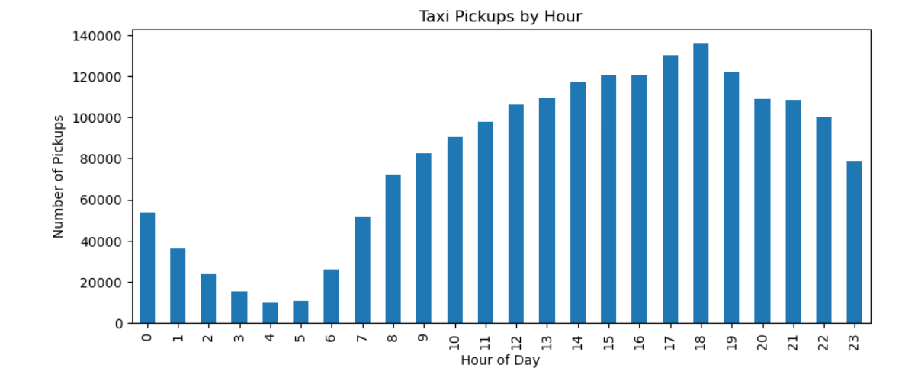
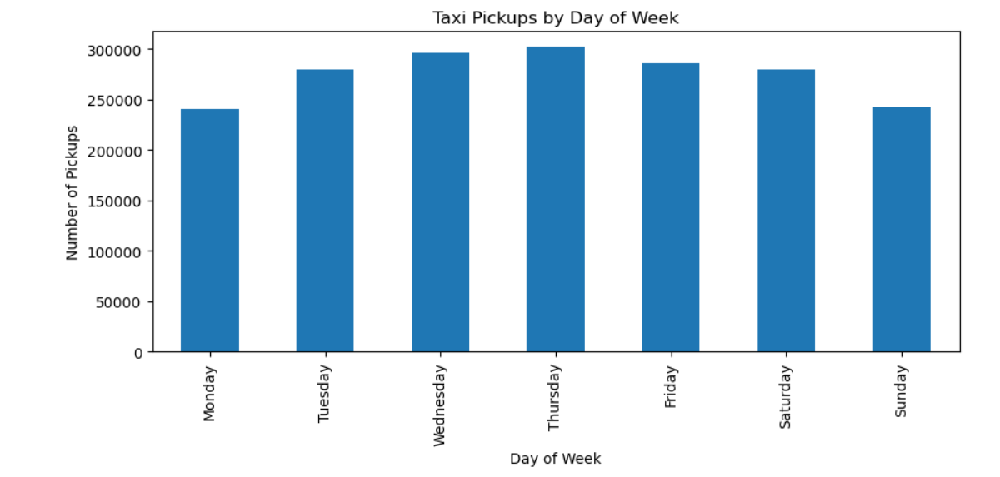
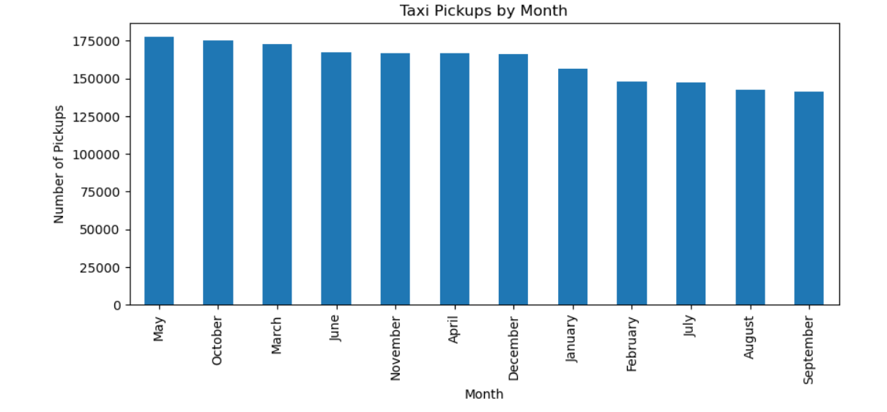

# NYC Taxi Data Analysis (EDA)
Exploratory Data Analysis of 2023 NYC Yellow Taxi trip data to identify demand patterns, revenue trends, and operational insights for taxi services.

## Project Overview
This project performs Exploratory Data Analysis (EDA) on the 2023 NYC Yellow Taxi dataset to understand taxi demand patterns and operational insights.

The objective is to analyse trip patterns to help taxi operators optimise services, improve efficiency, and maximise revenue.

## Dataset
The dataset contains trip records of yellow taxis in New York City provided by the NYC Taxi and Limousine Commission (TLC).

The data includes:
- Pickup and drop-off timestamps
- Pickup and drop-off locations
- Trip distance
- Passenger count
- Fare amount
- Payment type
- Additional surcharges

Since the dataset is extremely large, a **5% hourly stratified sample** was used for analysis to maintain representative patterns while reducing computational load.
The dataset can be downloaded from the NYC Taxi and Limousine Commission:

https://www.nyc.gov/site/tlc/about/tlc-trip-record-data.page

Monthly parquet files for 2023 were used in this project.

## Methodology

### 1. Data Preparation
- Loaded monthly parquet files
- Converted datetime columns
- Extracted pickup hour and date
- Applied 5% stratified sampling per hour
- Combined all months into a single dataset

### 2. Data Cleaning
- Reset index and standardised columns
- Merged duplicate `airport_fee` columns
- Checked missing values
- Removed unrealistic values (negative fares, extreme distances)

### 3. Exploratory Data Analysis
The analysis focuses on:

- Distribution of taxi pickups by **hour of the day**
- Distribution of pickups by **day of the week**
- Monthly demand trends
- Passenger count patterns
- Payment method usage
- Trip distance distribution

## Key Insights

- Taxi demand peaks during **evening commute hours (around 5–7 PM)**.
- **Weekends show slightly lower demand** compared to weekdays.
- **Summer and holiday months show higher taxi usage**.
- Most trips have **1 passenger**, indicating taxis are primarily used for individual travel.
- **Credit cards dominate payments**, suggesting widespread digital transactions.

## Visualisations

### Hourly Pickup Distribution


### Weekday Pickup Distribution


### Monthly Pickup Distribution


## Tools Used
- Python
- Pandas
- NumPy
- Matplotlib
- Seaborn
- Jupyter Notebook

## Repository Structure

```
nyc-taxi-eda
│
├── data
├── notebooks
├── images
├── report
├── requirements.txt
└── README.md
```

## Author
Ramyata Rohan Mendhe
